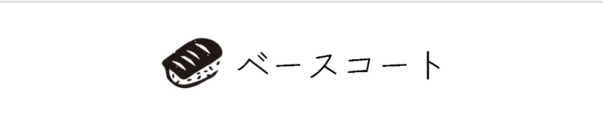
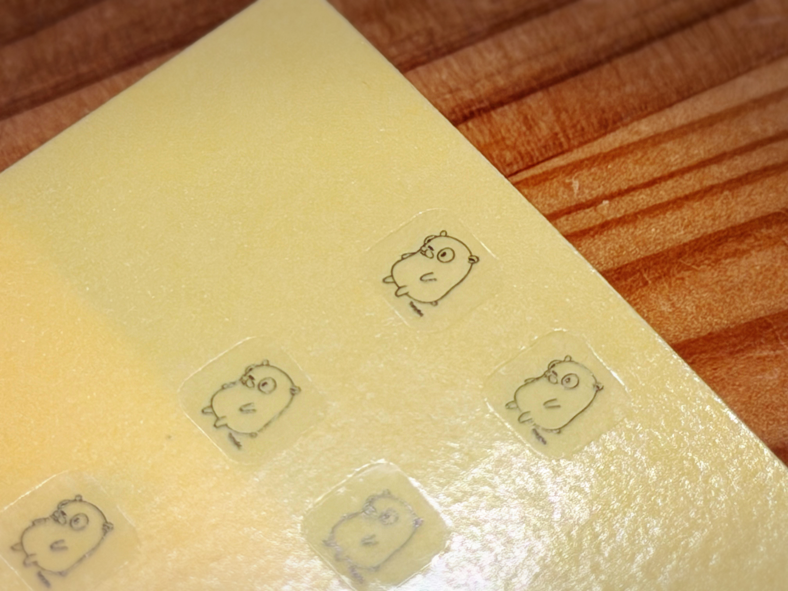

# Keycap Nail Art Workshop

🌏 Languages: [English](./README.en.md)

キーキャップにおしゃれをさせてあげよう！
100円ショップでも揃う簡単な材料を使って、自分だけのキーキャップをジェルネイルでデコレーションするワークショップです。

👉 [TinyGo Keeb Blog - 透明キーキャップをおしゃれに！](https://tinygo-keeb.org/blog/?p=32)

---

## 用意するもの

| Item        | Purpose  | Note                                                             |
|-------------|----------|------------------------------------------------------------------|
| <nobr>透明キーキャップ</nobr> | <nobr>ベース素材</nobr>    | ワークショップでは Cherry MX 互換キーキャップを利用します。                              |
| <nobr>ベースコート</nobr> | <nobr>下地</nobr>       | ジェルネイル用下地。            |
| <nobr>トップコート</nobr> | <nobr>仕上げ</nobr>      | ツヤ出し＆保護用。             |
| <nobr>カラージェル</nobr> | <nobr>デザイン用</nobr>    | 好きな色を選んで OK！          |
| <nobr>ネイルシールやパーツなど</nobr> | <nobr>デコレーション用</nobr> | 小さくてかわいいパーツが揃っています。   |
| <nobr>LEDライト</nobr> | <nobr>硬化用</nobr>      | ネイル用ミニ LED。           |
| <nobr>ピンセット</nobr> | <nobr>パーツ配置用</nobr>   | 大切に扱ってください。           |
| <nobr>ネイル台</nobr>  | <nobr>作業台</nobr>      | キーキャップを安定させるのに使います。   |
| <nobr>マグネット</nobr> | <nobr>特殊効果用</nobr>    | マグネット対応ジェルで奥行きを出せます。  |

---

## 手順

1. **ベースコートを塗る**  
   透明キーキャップに薄くベースコートを塗ります。  
   

2. **LED で硬化させる (1〜3分)**  
   ネイル用 LED ライトを使って固めます。  
   

3. **おしゃれさせる！**  
   好きなカラージェルを塗ったり、ネイルシールを貼ったり、パーツをのせたりして自由にデザイン！  
   

4. **LED で硬化させる (1〜3分)**  
   デザインが完成したら再度ライトで固めます。

5. **トップコートを塗る**  
   仕上げにトップコートを薄く塗ってツヤを出します。

6. **LED で硬化させる (1〜3分)**  
   最後に硬化させて完成です。

---

## アドバイス

- 厚塗りしすぎると LED の光が届かずに硬化しにくいことがあります。薄く重ねていくのがコツです。
- トップコートの前に一度ホコリを軽く払っておくときれいに仕上がります。
- パーツをのせるときは **ピンセット** を使うと扱いやすいです。

---

Presented by [TinyGo Keeb Workshop](https://tinygo-keeb.org)

The Go gopher was designed by Renee French.  
The design is licensed under the Creative Commons 3.0 Attributions license.
